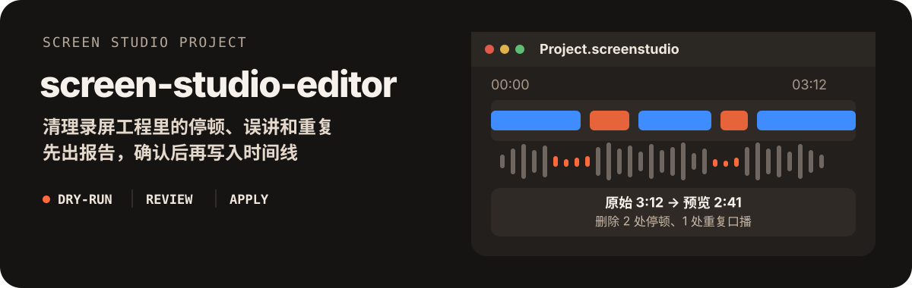

# screen-studio-editor

<p align="center">
  
</p>

把 Screen Studio 的 `.screenstudio` 工程交给 Agent，删除停顿、误讲、重复录制和空片段。默认先出 dry-run 报告，确认后再写入时间线。导出成片后的字幕交给 [oil-subtitle](https://github.com/oil-oil/oil-subtitle)。

[快速开始](#快速开始) · [四种用法](#四种用法) · [数据边界](#数据边界)

## 四种用法

- **质量剪辑：** 结合声音、ASR、屏幕活动和模型候选，对照创作者偏好给出删除建议。
- **只清停顿：** 没有偏好样本，或不需要语义剪辑时，只处理静音和过长停顿。
- **合并工程：** 把补录工程追加到主工程末尾，或插到指定 slice 之后。
- **口播换 PPT：** 在克隆工程上，把占位屏幕轨换成按讲述对齐的页面。

本仓库只改 Screen Studio 工程。不要用它烧录 MP4 字幕。

## 快速开始

运行环境：macOS、Python 3、Homebrew。`setup.sh` 会准备独立虚拟环境，缺少 FFmpeg 时通过 Homebrew 安装。

```bash
git clone https://github.com/oil-oil/screen-studio-editor ~/.claude/skills/screen-studio-editor
bash ~/.claude/skills/screen-studio-editor/setup.sh
```

质量剪辑需要百炼 FunAudio ASR 和用于全片判断的模型密钥，从环境变量 `DASHSCOPE_API_KEY`、`ZENMUX_API_KEY` 读取，不要写进仓库。

配置完成后，把工程路径告诉 Agent：

```text
帮我剪这个工程 /path/to/Tutorial.screenstudio，先出报告，不要直接写入。
```

Agent 的完整执行规范见 [SKILL.md](SKILL.md)。

## 质量剪辑怎么跑

普通口播和屏幕教程只走这一条入口，不要先额外跑一遍 `process.py --dry-run`：

```bash
.venv/bin/python3 scripts/smart_edit_workflow.py \
  --project "/path/to/Tutorial.screenstudio"
```

这条命令默认不改时间线。它会完成基线分析、全片候选、偏好仲裁和最终 dry-run，并复用仍然有效的缓存。审查工程旁的 `smart-edit-final-report.json` 后，再加 `--apply`。

如果工程在审查后被 Screen Studio 重新保存，先重新 dry-run，不要套用旧结果。应用后在 Screen Studio 里预览工程；导出 MP4 之前由使用者确认。

没有 `creator_preferences` 时，不要借用别人的偏好文件，改用只清停顿。

## 配置放在用户目录

个人路径、热词、偏好样本和 API Key 都放在仓库外面，例如：

```text
~/.config/screen-studio-editor/config.json
```

```json
{
  "projects_root": "/path/to/screen-studio-projects",
  "creator_preferences": "/path/to/creator-edit-preferences.json",
  "hotwords": "/path/to/hotwords.json",
  "model": "google/gemini-3.7-flash"
}
```

命令行参数优先于环境变量，环境变量优先于这份配置。工程产物默认写在源工程旁边；配置了 `projects_root` 时写到该目录。

## 数据边界

- 远程 ASR 会把从工程音频提取的声音发给百炼。
- 全片语义候选会把对齐后的音画证据发给已配置的模型。
- `project.json`、用户在 Screen Studio 里的修改、个人配置和偏好样本都是用户数据，不要提交进仓库。
- dry-run、报告审查和最终写入都在本机完成。PPT 替换只操作克隆工程。

## 脚本索引

| 脚本 | 作用 |
| --- | --- |
| `scripts/smart_edit_workflow.py` | 默认质量剪辑编排 |
| `scripts/process.py` | 本地分析、停顿清理、cuts 校验和时间线写入 |
| `scripts/global_edit_planner.py` | 全片语义候选 |
| `scripts/preference_edit_arbiter.py` | 创作者偏好学习和候选仲裁 |
| `scripts/build_review_proxy.py` | 构建源时间对齐的音画代理 |
| `scripts/merge_projects.py` | 合并 Screen Studio 工程 |
| `scripts/auto_ppt_replace.py` | 用按口播对齐的页面替换屏幕轨 |
| `scripts/bailian_transcribe.py` | 工程音频的百炼转录 |

诊断脚本见 [剪辑诊断参考](reference/editing-diagnostics.md)。默认流程不要直接调用它们。

## 测试

```bash
./.venv/bin/python3 -m unittest discover -s tests
```
